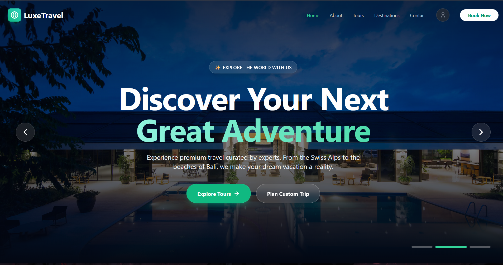

# 🚀 Luxe Travel – Advanced Git & DevOps Team Collaboration Project
---


## 👥 Group Members
| Name | Student ID | Role |
|------|------------|------|
| **D.M.S Dilshan Madhushankha** | ITBIN-2313-0137 | DevOps / Release Manager |
| **D.P.D Sharadha Pathirana** | ITBIN-2313-0078 | Frontend / Web Developer |

## 📌 Project Description

Luxe Travel is a modern travel agency web application developed using Next.js with a fully automated CI/CD pipeline.
The platform provides users with a professional frontend travel website while also offering a secure admin panel to manage bookings, tours, and customer data.
This project simulates a real-world DevOps team environment by implementing professional Git workflows, automated testing, CI/CD pipelines, and cloud deployment.


## 🌍 Live Deployment

🔗 **Frontend Website:** https://devops-collab-assignment-lux-travel.vercel.app/  
🔗 **Admin Panel:** https://devops-collab-assignment-lux-travel.vercel.app/admin


```bash
Admin panel email : admin@gmail.com
Admin panel password : admin@123
```


---

## 🛠️ Technologies Used

- Next.js 16 (React + TypeScript)
- Tailwind CSS
- Node.js 18+
- Git & GitHub
- GitHub Actions (CI/CD)
- Vercel (Cloud Deployment)
- Firebase (Backend & Database)

---
## ✨ Features

| Category   | Features |
|------------|-----------|
| 🌐 **Frontend** | - Modern travel agency UI <br> - Responsive design <br> - Tour packages showcase <br> - Contact & booking forms <br> - Mobile-friendly navigation |
| 🔐 **Admin Panel** | - Secure admin dashboard <br> - View & manage bookings <br> - Manage tour packages <br> - User data management <br> - Dashboard analytics |
| ⚙️ **DevOps** | - Automated CI pipeline <br> - Auto deployment to Vercel <br> - GitHub branch protection <br> - Team-based Git workflow |

---

## 🌱 Branch Strategy

We implemented the following branching strategy:

- `main` – Production-ready branch (protected)
- `develop` – Integration branch
- `feature/backend*` – Feature development branches
- `feature/frontend*` – Feature development branches

---

## 🧑‍💻 Individual Contributions & Commit Evidence

We are actively contributed to the project using professional Git workflows including **feature branches, pull requests, merges, and conflict resolution,** Below is a detailed breakdown of each member’s contributions based on commit history and pull requests.

---

### 👨‍💻 D.M.S Dilshan Madhushankha – ITBIN-2313-0137  
**Role:** DevOps Engineer 

**Key Contributions:**
- GitHub repository initialization and configuration
- Branch structure setup (`main`, `develop`, `feature/*`)
- CI/CD pipeline implementation using GitHub Actions
- Vercel deployment configuration and automation
- Admin panel UI development
- Firebase backend integration
- Merge conflict resolution and PR handling
- Project documentation and README maintenance

**Major Commits & Pull Requests:**
- Merge pull request #11 from sachilz/develop – resolved conflicts & fixed build
- Merge pull request #8 from sachilz/develop
- Merge pull request #7 from sachilz/feature/frontend
- Merge pull request #3 from sachilz/sachilz-patch-1
- Update README.md
- Added frontend layouts, pages, icons, and global styles
- Added src/lib utilities and project configuration updates

---

### 👨‍💻 D.P.D Sharadha Pathiraba – ITBIN-2313-0078
**Role:** Full Stack Developer  

**Key Contributions:**
- Firebase backend configuration
- Database connection setup
- Admin panel backend logic
- Component development
- Environment and configuration file setup
- Git ignore rules and project configuration
- Feature branch development and pull request creation

**Major Commits & Pull Requests:**
- Merge pull request #10 from sachilz/develop
- Merge pull request #9 from sachilz/feature/backend
- Merge pull request #6 from sachilz/develop
- Merge pull request #5 from sachilz/feature/backend
- Added Firebase configuration files
- Added admin panel backend files
- Added environment variable handling
- Added config files and image collections

---

### ✅ Collaboration Evidence

- Multiple feature branches created and merged  
- Multiple pull requests submitted and reviewed  
- Merge conflicts intentionally created and successfully resolved  
- Balanced commit distribution across all members  
- Clear CI/CD workflow execution history  
- Continuous deployment via GitHub Actions  
---
## ⚙️ Setup Instructions

### 🔧 Prerequisites
- Node.js (version 18 or higher)
- Git
- GitHub Account

---

# 📥 Installation

```bash
https://github.com/sachilz/devops-collab-assignment-LuxTravel.git
```
## Navigate to project directory
```bash
cd devops-collab-assignment-LuxTravel
```

## Install dependencies
```bash
npm install
```

## Run development server
```bash
npm run dev
```

# ✅ How to Open Admin Panel (Local + Live)

## Frontend
```bash
https://devops-collab-assignment-lux-travel.vercel.app/
```

## Admin Panel
```bash
https://devops-collab-assignment-lux-travel.vercel.app/admin
```

## 🗂️ Repository Structure

```bash
luxe-travel/
├── .github/
│   └── workflows/
│       ├── ci.yml
│       └── deploy.yml
├── public/
│   └── images/
├── src/
│   └── app/
│       ├── admin/
│       │   └── page.tsx
│       ├── components/
│       │   └── ProfileModal.tsx
│       ├── lib/
│       │   ├── bookings.ts
│       │   └── firebase.ts
│       ├── globals.css
│       ├── layout.tsx
│       └── page.tsx
├── .env.local
├── .eslintrc.json
├── .gitignore
├── next-env.d.ts
├── next.config.js
├── package-lock.json
├── package.json
├── postcss.config.js
├── tailwind.config.ts
├── tsconfig.json
└── README.md

